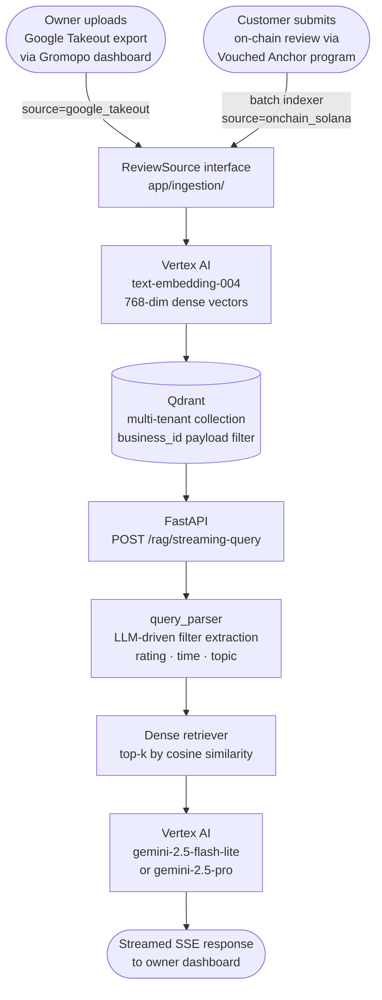

# chat — Multi-Source RAG API for Restaurant Review Insights

[](https://github.com/gromopo-tech/chat/actions/workflows/ci.yml)

Multi-tenant, multi-source RAG service (FastAPI · Vertex AI · Qdrant) that unifies owner-uploaded Google review exports and on-chain Solana reviews behind a pluggable `ReviewSource` interface — with per-business `business_id` payload filtering for tenant isolation, an LLM-driven query parser that extracts structured metadata filters from natural-language questions, and a recall@k eval harness that scores 20/20 (100%) at avg 1.6s latency on 20 ground-truth queries. Part of the [Gromopo](https://github.com/gromopo-tech/gromopo) system.

---

## Architecture



---

## Tech Stack

| Layer | Technology |
|---|---|
| Language | Python 3.13 |
| API framework | FastAPI + Uvicorn |
| LLM | Vertex AI `gemini-2.5-flash-lite` (default), `gemini-2.5-pro` (complex queries) |
| Embeddings | Vertex AI `text-embedding-004` (768-dim) |
| Vector DB | Qdrant (gRPC, named dense vectors, payload filtering) |
| Orchestration | LangChain (retriever interface, prompt templates, runnable chains) |
| Ingestion | Pluggable `ReviewSource` — Google Takeout JSON + on-chain Solana (manual Borsh via `solders`) |
| Deploy target | Docker / Cloud Run |

---

## Repo Layout

```
app/              FastAPI application — chains, query parser, vectorstore, models, prompts
app/ingestion/    Pluggable ReviewSource interface + Google Takeout and on-chain Solana sources
scripts/          Ingestion runner CLI (run_ingestion.py)
eval/             Recall@k eval harness with 20 ground-truth queries
reviews/          Sample Google Business Profile export
tests/            Unit tests (pytest) — query parsing, filter building, ingestion sources
```

---

## Local Development

> Requires Python 3.13, Docker, and a GCP project with Vertex AI API enabled.

### 1. Clone

```sh
git clone https://github.com/gromopo-tech/chat.git
cd chat
```

### 2. Authenticate with GCP

```sh
gcloud auth application-default login
```

This creates the ADC file at `~/.config/gcloud/application_default_credentials.json`.

### 3. Configure environment variables

```sh
cp .env.example .env
```

Edit `.env` and fill in your GCP project and region:

```sh
QDRANT_HOST=qdrant          # leave as-is — this is the docker-compose service name
VERTEX_PROJECT=your-gcp-project-id
VERTEX_LOCATION=us-central1
```

**Do not export `QDRANT_HOST` in your shell.** docker-compose reads `.env` automatically and passes `QDRANT_HOST=qdrant` to the app container (where `qdrant` resolves via Docker's internal network). Local scripts run outside Docker and use the default `localhost` — exporting `QDRANT_HOST=qdrant` in your shell would break them.

### 4. Start Qdrant + API

```sh
docker-compose up -d
```

- Qdrant: http://localhost:6333
- API: http://localhost:8080
- Interactive docs: http://localhost:8080/docs

### 5. Install Python dependencies (for scripts / tests)

```sh
python3 -m venv .venv
source .venv/bin/activate
pip install -r requirements.txt
```

### 6. Ingest reviews

Run this from the repo root with the venv active. The script connects to Qdrant on `localhost:6334` by default — no env var needed.

```sh
python3 -m ingest.run_ingest \
  --source google_takeout \
  --business-id sandys-sandies \
  --input reviews/reviews-sample.json
```

Expected output:
```
✅ Ingestion complete — ingested: 14, skipped: 0, errors: 0
```

or ingest reviews from solana devnet (must have seeded devnet reviews first, see: [gromopo-tech/vouched](https://github.com/gromopo-tech/vouched)):
```sh

python3 -m ingest.run_ingest \
  --source onchain_solana \
  --business-id sandys-sandies \
  --reviewee <merchant_wallet_from_seed_output>
```

Verify both sources are in Qdrant — query with a source filter to confirm:
```sh
curl -s -X POST http://localhost:6333/collections/reviews/points/scroll \
  -H 'Content-Type: application/json' \
  -d '{
    "filter": {"must": [{"key": "source", "match": {"value": "onchain_solana"}}]},
    "with_payload": true,
    "limit": 5
  }' | python3 -m json.tool | grep -E '"source"|"text"|"business_id"'
  ```

### 7. Run the tests

```sh
pip install -r requirements-dev.txt
python3 -m pytest tests/
```

### 8. Self-serve ingest endpoint

The Gromopo dashboard's "Upload Reviews" page calls this endpoint directly. You can also call it with curl for testing:

```sh
curl -X POST "http://localhost:8080/ingest/google_takeout" \
  -H "Content-Type: application/json" \
  -H "Authorization: Bearer $INGEST_SHARED_SECRET" \
  -d '{
    "business_id": "sandys-sandies", 
    "reviews": [<paste reviews array from Google Takeout JSON here>]
  }'
```

Set `INGEST_SHARED_SECRET` to the same value in both `.env` and Gromopo's `.env.local`. The endpoint is synchronous and handles up to ~200 reviews comfortably; production deployments would queue larger batches via Cloud Tasks / Pub/Sub.

### 9. Query the API

```sh
curl -X POST "http://localhost:8080/rag/streaming-query" \
  -H "Content-Type: application/json" \
  -d @- <<'EOF'
{
  "query": "How can I improve business?",
  "business_id": "sandys-sandies",
  "business_name": "Sandy's Sandies"
}
EOF
```

`business_id` scopes retrieval to that tenant's reviews. `business_name` personalises the LLM prompts (e.g. "You are helping the owner of Sandy's Sandies…"). Both are optional — omit them to query across all reviews with generic phrasing.

---

## Key Design Decisions

### LLM-driven query parser (`app/query_parser.py`)
Rather than hand-coding keyword rules, a `gemini-2.5-flash-lite` call extracts structured Qdrant metadata filters (rating range, time window) from natural-language questions before retrieval. This means queries like "any complaints in the past 6 months?" automatically narrow the vector search to `rating ∈ {1,2}` + `createTime ≥ 6 months ago` — without the caller needing to specify filters explicitly.

### Dynamic k selection (`app/chains.py`)
Retrieval k scales with query intent: analytical summaries use k=1000 (near-exhaustive), comparison queries k=100, specific-example queries k=30. This avoids the common mistake of using a single fixed k for all query types.

### Dense-only retrieval (current)
The codebase is structured for hybrid dense+sparse retrieval (Qdrant named vectors, `text-embedding-004` dense + 30522-dim sparse slot). Sparse vectors are not yet generated by the embedding model in this configuration; the fallback to dense-only is the active path. The architecture is ready to enable hybrid search when the embedding pipeline produces sparse vectors.

---

## Production Considerations

| Concern | Approach |
|---|---|
| **Deployment** | Dockerized for Cloud Run; `docker-compose.yml` mirrors prod service layout |
| **Vector DB** | Swap `QDRANT_HOST` env var to point at Qdrant Cloud; no code changes needed |
| **Vertex AI quota** | Embed in batches; add exponential backoff on `ResourceExhausted`. Current script embeds one-at-a-time — fine for <1k reviews |
| **Embedding cache** | Upsert uses Qdrant point IDs derived from `review_id`; re-running the ingestion script is idempotent |
| **Multi-tenancy** | `business_id` in Qdrant payload + retriever filter; `/rag/streaming-query` and `/query` accept `business_id` for per-tenant isolation and `business_name` to personalise LLM prompts |
| **Observability** | `structlog` structured logging on retrieval, embedding, and LLM calls with latency in ms; hook into Cloud Logging in prod |
| **Eval** | `python3 eval/run_eval.py` — computes recall@k against 20 ground-truth queries; run before and after prompt/model changes |

---

## Roadmap

- [x] `ReviewSource` abstraction with `GoogleTakeoutSource` implementation (`app/ingestion/`)
- [x] `business_id` payload filter for full multi-tenant isolation
- [x] `structlog` structured logging with per-request latency traces
- [x] Recall@k eval harness with 20 ground-truth queries (`eval/run_eval.py`)
- [x] GitHub Actions CI (lint + test + docker-build)
- [x] `OnChainReviewSource` — Solana RPC + manual Borsh deserialization indexer polling vouched Anchor program on devnet (`app/ingestion/onchain_solana.py`)
- [x] `POST /ingest/google_takeout` — shared-secret authenticated endpoint for self-serve owner uploads from Gromopo dashboard
- [ ] Sparse vector support once `text-embedding-004` sparse output is available

---

## Related Repos

| Repo | Role |
|---|---|
| [gromopo-tech/gromopo](https://github.com/gromopo-tech/gromopo) | Next.js ordering platform — owner dashboard, on-chain USDC payments, review upload UI |
| [gromopo-tech/vouched](https://github.com/gromopo-tech/vouched) | Solana Anchor program — purchase-verified on-chain review storage, PDAs, devnet deployment |

## 🐳 Using Docker Compose for App and Qdrant

You can run both Qdrant and the FastAPI app with Docker Compose:

```sh
docker-compose up -d
```

- The app will be available at [http://localhost:8080](http://localhost:8080)
- Qdrant will be at [http://localhost:6333](http://localhost:6333)

You can check the status of the containers with:

```sh
docker-compose ps
```

and you can check the logs of both containers with:

```sh
docker-compose logs -f
```
---

## 🛠️ Troubleshooting

- **Qdrant connection errors:**
  - Make sure Qdrant is running (`docker-compose up -d qdrant`).
  - Check that your app is using the correct host/port or URL/API key.
- **Vertex AI authentication errors:**
  - Ensure `GOOGLE_APPLICATION_CREDENTIALS` is set and points to your ADC file (locally).
  - On Cloud Run, use the default service account or set up Workload Identity.
- **No context returned:**
  - Make sure you ran the embedding script after Qdrant was started.

---

## 🧹 Cleaning Up

To stop and remove all containers:
```sh
docker-compose down
```
To remove all data (including Qdrant data):
```sh
docker-compose down -v
```

---

## 📦 Production

- Use Qdrant Cloud by setting `QDRANT_URL` and `QDRANT_API_KEY`.
- Run the embedding script from a cloud VM for large datasets for better speed and reliability.
- On Cloud Run, `GOOGLE_CLOUD_PROJECT` is set automatically; set `VERTEX_LOCATION` as an env var.

---

## 📄 License
MIT
