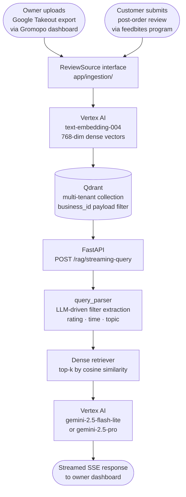

# chat — Multi-Source RAG API for Restaurant Review Insights

[](https://github.com/gromopo-tech/chat/actions/workflows/ci.yml)

Multi-tenant RAG service that unifies owner-uploaded Google review exports and on-chain Solana review data behind a pluggable `ReviewSource` interface, with per-business payload filtering for tenant isolation. Built with FastAPI, Vertex AI, and Qdrant. Part of the [Gromopo](https://github.com/gromopo-tech/gromopo) system.

---

## Architecture



---

## Tech Stack

| Layer | Technology |
|---|---|
| Language | Python 3.13 |
| API framework | FastAPI + Uvicorn |
| LLM | Vertex AI `gemini-2.5-flash-lite` (default), `gemini-2.5-pro` (complex queries) |
| Embeddings | Vertex AI `text-embedding-004` (768-dim) |
| Vector DB | Qdrant (gRPC, named dense vectors, payload filtering) |
| Orchestration | LangChain (retriever interface, prompt templates, runnable chains) |
| Ingestion | Pluggable `ReviewSource` — Google Takeout JSON + on-chain Solana (anchorpy) |
| Deploy target | Docker / Cloud Run |

---

## Repo Layout

```
app/              FastAPI application — chains, query parser, vectorstore, models, prompts
app/ingestion/    Pluggable ReviewSource interface + Google Takeout and on-chain Solana sources
scripts/          Ingestion runner CLI (embed_reviews.py)
eval/             Recall@k eval harness with ground-truth query set
reviews/          Sample Google Business Profile export (Duck and Decanter)
tests/            Unit tests (pytest) — query parsing, filter building, ingestion sources
```

---

## Local Development

> Requires Python 3.13, Docker, and a GCP project with Vertex AI API enabled.

### 1. Clone

```sh
git clone https://github.com/gromopo-tech/chat.git
cd chat
```

### 2. Authenticate with GCP

```sh
gcloud auth application-default login
```

This creates the ADC file at `~/.config/gcloud/application_default_credentials.json`.

### 3. Set environment variables

```sh
export GOOGLE_APPLICATION_CREDENTIALS=$HOME/.config/gcloud/application_default_credentials.json
export VERTEX_LOCATION=<gcp-region>
export VERTEX_PROJECT=<gcp-project-id>
```

### 4. Start Qdrant + API

```sh
docker-compose up -d
```

- Qdrant: http://localhost:6333
- API: http://localhost:8080
- Interactive docs: http://localhost:8080/docs

### 5. Install Python dependencies (for scripts / tests)

```sh
python3 -m venv .venv
source .venv/bin/activate
pip install -r requirements.txt
```

### 6. Embed reviews

```sh
python -m scripts.embed_reviews --dir reviews/
```

Expected output:
```
🧠 Embedding 14 reviews one by one...
✅ Inserted 14 reviews into collection 'reviews'.
```

### 7. Query the API

```sh
curl -X POST "http://localhost:8080/rag/streaming-query" \
  -H "Content-Type: application/json" \
  -d '{"query": "What do people say about the sandwiches?"}'
```

---

## Key Design Decisions

### LLM-driven query parser (`app/query_parser.py`)
Rather than hand-coding keyword rules, a `gemini-2.5-flash-lite` call extracts structured Qdrant metadata filters (rating range, time window) from natural-language questions before retrieval. This means queries like "any complaints in the past 6 months?" automatically narrow the vector search to `rating ∈ {1,2}` + `createTime ≥ 6 months ago` — without the caller needing to specify filters explicitly.

### Dynamic k selection (`app/chains.py`)
Retrieval k scales with query intent: analytical summaries use k=1000 (near-exhaustive), comparison queries k=100, specific-example queries k=30. This avoids the common mistake of using a single fixed k for all query types.

### Dense-only retrieval (current)
The codebase is structured for hybrid dense+sparse retrieval (Qdrant named vectors, `text-embedding-004` dense + 30522-dim sparse slot). Sparse vectors are not yet generated by the embedding model in this configuration; the fallback to dense-only is the active path. The architecture is ready to enable hybrid search when the embedding pipeline produces sparse vectors.

---

## Production Considerations

| Concern | Approach |
|---|---|
| **Deployment** | Dockerized for Cloud Run; `docker-compose.yml` mirrors prod service layout |
| **Vector DB** | Swap `QDRANT_HOST` env var to point at Qdrant Cloud; no code changes needed |
| **Vertex AI quota** | Embed in batches; add exponential backoff on `ResourceExhausted`. Current script embeds one-at-a-time — fine for <1k reviews |
| **Embedding cache** | Upsert uses Qdrant point IDs derived from `review_id`; re-running the ingestion script is idempotent |
| **Multi-tenancy** | Add `business_id` to Qdrant payload and retriever filter; `/rag/streaming-query` accepts `business_id` in request body for per-tenant isolation |
| **Observability** | Add `structlog` for structured timed log entries on retrieval, embedding, and LLM calls; hook into Cloud Logging in prod |
| **Eval** | `eval/run_eval.py` computes recall@k against a ground-truth query set; run before and after prompt/model changes |

---

## Roadmap

- [ ] `IngestionSource` abstraction with `GoogleTakeoutSource` + `OnChainSolanaSource` implementations
- [ ] `business_id` payload filter for full multi-tenant isolation
- [ ] `POST /ingest/google_takeout` endpoint for self-serve owner uploads from Gromopo dashboard
- [ ] `anchorpy`-based on-chain indexer polling feedbites Anchor program on Solana devnet
- [ ] `structlog` structured logging with per-request latency traces
- [ ] Recall@k eval harness with 20 ground-truth queries
- [ ] GitHub Actions CI (lint + test + docker-build)
- [ ] Sparse vector support once `text-embedding-004` sparse output is available

---

## Related Repos

| Repo | Role |
|---|---|
| [gromopo-tech/gromopo](https://github.com/gromopo-tech/gromopo) | Next.js ordering platform — owner dashboard, on-chain USDC payments, review upload UI |
| [tomasArizu13/feedbites](https://github.com/tomasArizu13/feedbites) | Solana Anchor program — on-chain review storage, PDAs, devnet deployment |

## 🐳 Using Docker Compose for App and Qdrant

You can run both Qdrant and the FastAPI app with Docker Compose:

```sh
docker-compose up -d
```

- The app will be available at [http://localhost:8080](http://localhost:8080)
- Qdrant will be at [http://localhost:6333](http://localhost:6333)

You can check the status of the containers with:

```sh
docker-compose ps
```

and you can check the logs of both containers with:

```sh
docker-compose logs -f
```
---

## 🛠️ Troubleshooting

- **Qdrant connection errors:**
  - Make sure Qdrant is running (`docker-compose up -d qdrant`).
  - Check that your app is using the correct host/port or URL/API key.
- **Vertex AI authentication errors:**
  - Ensure `GOOGLE_APPLICATION_CREDENTIALS` is set and points to your ADC file (locally).
  - On Cloud Run, use the default service account or set up Workload Identity.
- **No context returned:**
  - Make sure you ran the embedding script after Qdrant was started.

---

## 🧹 Cleaning Up

To stop and remove all containers:
```sh
docker-compose down
```
To remove all data (including Qdrant data):
```sh
docker-compose down -v
```

---

## 📦 Production

- Use Qdrant Cloud by setting `QDRANT_URL` and `QDRANT_API_KEY`.
- Run the embedding script from a cloud VM for large datasets for better speed and reliability.
- On Cloud Run, `GOOGLE_CLOUD_PROJECT` is set automatically; set `VERTEX_LOCATION` as an env var.

---

## 📄 License
MIT
